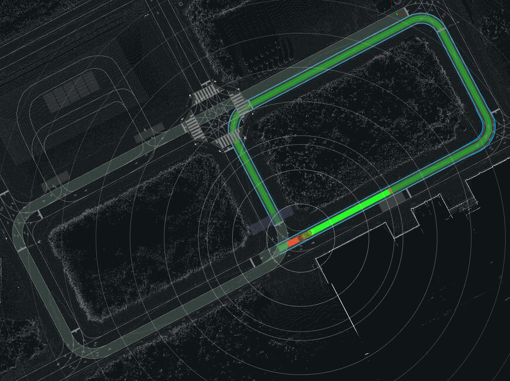
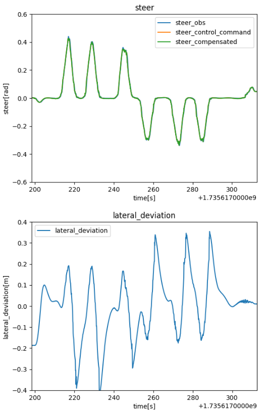
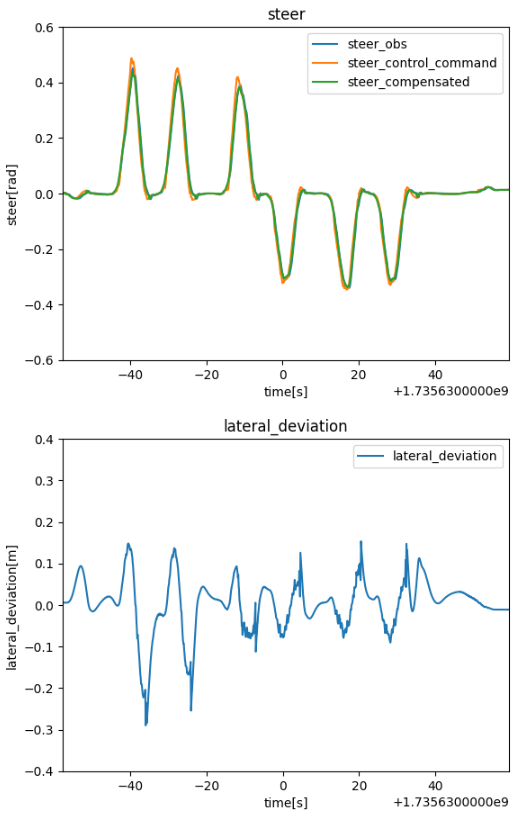
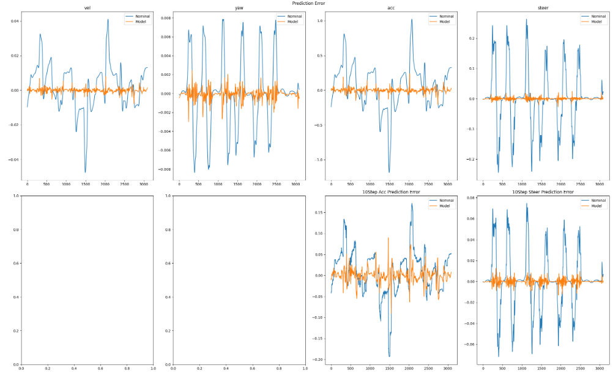
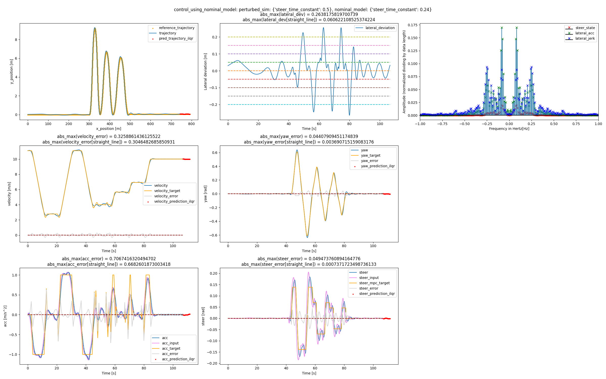
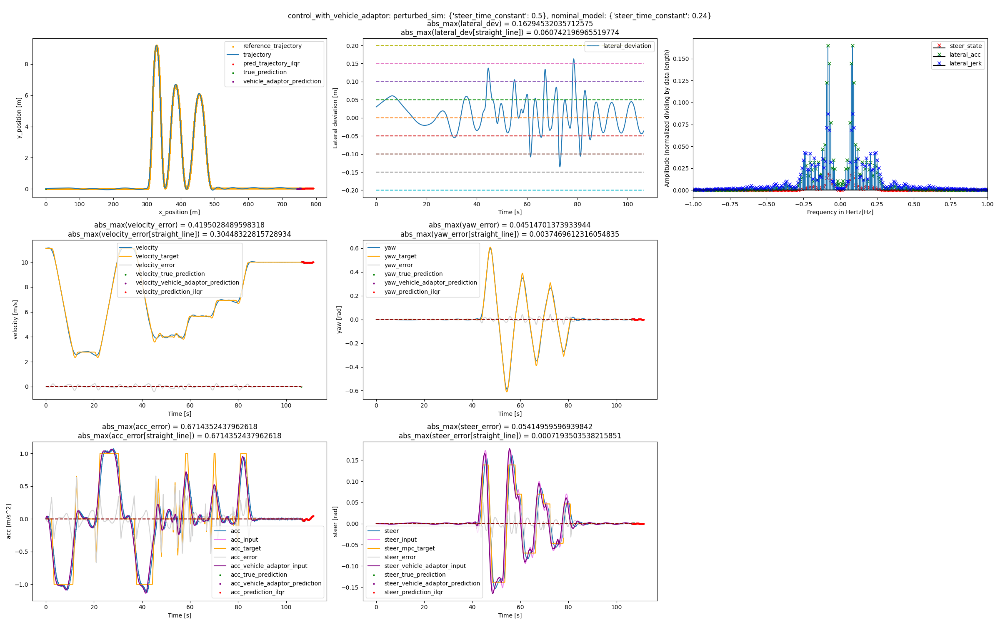

<p align="center">
  <a href="https://proxima-ai-tech.com/">
    
  </a>
</p>

# Autoware Vehicle Adaptor

In order to perform adaptive control that allows various vehicles to operate without detailed parameter calibration, it is placed in the lower part of the controller and corrects the input so that the ideal state based on the internal model of the controller is achieved according to the learned model.
However, if you are not going to do any learning and simply want to drive on Autoware with the default NN model, you do not need to follow this installation procedure, and it is sufficient to just do the normal Autoware setup.


# Provided features

To use all the functions of this package, execute the following setup command on the autoware_vehicle_adaptor directory:

```bash
pip3 install .
```

For the upcoming setup, execute the following command:

```bash
pip3 install -U .
```

For the training and evaluation, we can use the following rosbag record command:
```bash
ros2 bag record /localization/kinematic_state /localization/acceleration /vehicle/status/steering_status /control/command/control_cmd /control/trajectory_follower/lane_departure_checker_node/debug/deviation/lateral /system/operation_mode/state /vehicle/raw_vehicle_cmd_converter/debug/compensated_control_cmd /external/selected/control_cmd /control/command/actuation_cmd 
```
Not all of the topics listed here are always published.
The following topics are always required:
```bash
/localization/kinematic_state /localization/acceleration /vehicle/status/steering_status /system/operation_mode/state
```
Either of the following two is required, and the former is published when the vehicle is automatically driven by a `trajectory_follower_node`, and the latter is published when the data collection tool in the `autoware_tools` is used.
```bash
/control/command/control_cmd /external/selected/control_cmd
```
The following topic is required if you want to evaluate lateral deviation:
```bash
/control/trajectory_follower/lane_departure_checker_node/debug/deviation/lateral
```
The following topic is required if you want to evaluate the driving data with the vehicle_adaptor or include the driving data with the vehicle_adaptor in the training data.
```bash
/vehicle/raw_vehicle_cmd_converter/debug/compensated_control_cmd
```
The following topic is required if you want to use the NN based accel brake map calibrator or evaluate the accel brake inputs:
```bash
/control/command/actuation_cmd
```

To convert a rosbag file into a form that can be used for our training and evaluation, execute the following command:

```python
from autoware_vehicle_adaptor.data_analyzer import rosbag_to_csv
rosbag_to_csv.rosbag_to_csv(rosbag_dir)
```
Here, `rosbag_dir` represents the rosbag directory.
As a result, the necessary CSV files are generated in `rosbag_dir`.

## Trajectory following with vehicle adaptor

To use vehicle adaptor, you need set `use_vehicle_adaptor: true` and `enable_control_cmd_horizon_pub: true`.
When you start up autoware and perform automatic driving, the controller's input values are corrected based on the NN (ensemble) models saved in [vehicle_models](./vehicle_models).
By default, the models trained based on drive with nominal parameter are saved.
If you want to train models based on specific vehicle data and make changes, please refer to the next section.
The parameters in [controller_param.yaml](./autoware_vehicle_adaptor/param/controller_param.yaml), which includes following, need to be adjusted to match those of the controller.

| Parameter                                        | Type  | Description                    |
| ------------------------------------------------ | ----- | ------------------------------ |
| controller_parameter:vehicle_info:wheel_base        | float | wheel base [m]                 |
| controller_parameter:acceleration:acc_time_delay    | float | acceleration time delay [s]    |
| controller_parameter:acceleration:acc_time_constant | float | acceleration time constant [s] |
| controller_parameter:steering:steer_time_delay      | float | steer time delay [s]           |
| controller_parameter:steering:steer_time_constant   | float | steer time constant [s]        |

We test our vehicle adaptor with the following route:

<p style="text-align: center;">
    
</p>

The parameter `optimization_parameter:autoware_alignment:use_vehicle_adaptor` in [optimization_param.yaml](./autoware_vehicle_adaptor/param/optimization_param.yaml) is switched between `false` and `true` to compare driving without using the Vehicle Adaptor and driving with it.
Here, we use the trained [sample model](./vehicle_models).
The performance of the drive can be evaluated using [driving_log_plotter.py](./autoware_vehicle_adaptor/data_analyzer/driving_log_plotter.py).
Please refer to [test_drive_log_plotter.ipynb](./autoware_vehicle_adaptor/data_analyzer/test_drive_log_plotter.ipynb) for sample code for performance evaluation.
We will only display the resulting graphs for lateral deviation and steering here.

The following shows a nominal autoware mpc drive without using Vehicle Adaptor, with a lateral deviation of about 40 cm.

<p style="text-align: center;">
    
</p>

By using Vehicle Adaptor, the lateral deviation was reduced to about 30 cm, and driving was improved.

<p style="text-align: center;">
    
</p>


## Training and its evaluation

[test_vehicle_adaptor_model_training.ipynb](./autoware_vehicle_adaptor/data_analyzer/test_vehicle_adaptor_model_training.ipynb) is a useful reference for training the models.
The training is done using the gray box model, and the parameters of the nominal model are specified in [nimonal_param.yaml](./autoware_vehicle_adaptor/param/nominal_param.yaml).
The parameters that can be specified are the same as for [controller_param.yaml](./autoware_vehicle_adaptor/param/controller_param.yaml).
This parameter needs to be consistent during training and driving, but it does not need to match [controller_param.yaml](./autoware_vehicle_adaptor/param/controller_param.yaml), and [controller_param.yaml](./autoware_vehicle_adaptor/param/controller_param.yaml) can be changed to match the controller when driving even after training has been performed.

In order to train the models, training and validation data are required.
With the paths of the rosbag directories used for training and validation, `dir_train_0`, `dir_train_1`, `dir_train_2`,..., `dir_val_0`, `dir_val_1`, `dir_val_2`,... and the directory `save_dir` where you save the models, the model can be trained and saved in the python environment as follows:

```python
from autoware_vehicle_adaptor.data_analyzer import driving_learners
model_trainer = driving_learners.train_error_prediction_NN()
model_trainer.add_data_from_csv(dir_train_0, add_mode="as_train")
model_trainer.add_data_from_csv(dir_train_1, add_mode="as_train")
model_trainer.add_data_from_csv(dir_train_2, add_mode="as_train")
...
model_trainer.add_data_from_csv(dir_val_0, add_mode="as_val")
model_trainer.add_data_from_csv(dir_val_1, add_mode="as_val")
model_trainer.add_data_from_csv(dir_val_2, add_mode="as_val")
...
model_trainer.get_trained_model()
model_trainer.save_models(save_dir)
model_trainer.get_trained_ensemble_models(batch_sizes=[100],ensemble_size=5)
paths = [save_dir + "/vehicle_model_" + str(i+1) + ".pth" for i in range(5)]
model_trainer.save_ensemble_models(paths=paths)
```
If you rename `save_dir` to `vehicle_models` and place it in `autoware_vehicle_adaptor`, it will be loaded when using vehicle adaptor.

In some cases, training once may not work because it falls into the local minimum, but [test_vehicle_adaptor_model_training_with_relearn.ipynb](./autoware_vehicle_adaptor/data_analyzer/test_vehicle_adaptor_model_training_with_relearn.ipynb) can be used as a reference when repeating training to avoid this.

[test_NN_model_evaluator.ipynb](./autoware_vehicle_adaptor/data_analyzer/test_NN_model_evaluator.ipynb) is useful for evaluating how well the trained model can predict the dynamics of the driving data.
The default model is evaluated as follows.
<p style="text-align: center;">
    
</p>

## Brief simulation using a python simulator

First, to give the steer time constant in the python simulator, create the following file and save it in [autoware_vehicle_adaptor/python_simulator/supporting_data](./autoware_vehicle_adaptor/python_simulator/supporting_data) with the name `sim_setting.json`:

```json
{ "steer_time_constant": 0.5}
```

Next, after moving to [autoware_vehicle_adaptor/python_simulator](./autoware_vehicle_adaptor/python_simulator), run the following commands to test the slalom driving on the python simulator with the nominal control:

```bash
python3 run_vehicle_adaptor.py nominal_test (nominal_dir)
```

The results are saved in a directory that the user can specify, here `python_simulator/log_data/test_python_nominal_sim_(nominal_dir)`.

The following results were obtained.

<p style="text-align: center;">
    
</p>

The center of the upper row represents the lateral deviation.

To perform training using a figure eight driving and driving with Vehicle Adaptor based on the obtained model, run the following commands:

```bash
python3 run_vehicle_adaptor.py (trained_dir)
```

The result of the driving is stored in `python_simulator/log_data/test_python_vehicle_adaptor_sim_(trained_dir)`.


The following results were obtained.

<p style="text-align: center;">
    
</p>

The following are some of the parameters that can be specified:

| Parameter                | Type        | Description                                                                                                                                                                                                                                                                                  |
| ------------------------ | ----------- | -------------------------------------------------------------------------------------------------------------------------------------------------------------------------------------------------------------------------------------------------------------------------------------------- |
| steer_dead_band          | float       | steer dead band [rad]                                                                                                                                                                                                                                                                        |
| acc_time_delay           | float       | acceleration time delay [s]                                                                                                                                                                                                                                                                  |
| steer_time_delay         | float       | steer time delay [s]                                                                                                                                                                                                                                                                         |
| acc_time_constant        | float       | acceleration time constant [s]                                                                                                                                                                                                                                                               |
| steer_time_constant      | float       | steer time constant [s]                                                                                                                                                                                                                                                                      |

For example, to give the simulation side 0.5 [sec] of steer time constant and 0.001 [rad] of steer dead band, edit the `sim_setting.json` as follows.

```json
{ "steer_time_constant": 0.5, "steer_dead_band": 0.001 }
```

Please refer to [parameter_change_utils.py](./autoware_vehicle_adaptor/python_simulator/utils/parameter_change_utils.py) for other parameters.
The test method in [run_auto_parameter_change_sim.py](./autoware_vehicle_adaptor/python_simulator/run_auto_parameter_change_sim.py)　is also helpful.

# Parameter description

Some parameters are expressed in the form of a table. When the domain table is `[d_0, ..., d_n]` and the target table is `[t_0,...,t_n]`, the target value `t_i` is used when the domain value is `d = d_i`.
In the case of a value between nodes, it is linearly interpolated, and when `d` is less than `d_0`, `t_0` is used, and when `d_n` is greater than `d_n`, `t_n` is used.

The important parameters in the Vehicle Adaptor's changeable parameter file [optimization_param.yaml](./autoware_vehicle_adaptor/param/optimization_param.yaml) are as follows:


| Parameter                                  | Type        | Description                                                                                                                                                                                                                                        |
| ------------------------------------------ | ----------- | -------------------------------------------------------------------------------------------------------------------------------------------------------------------------------------------------------------------------------------------------- |
| weight_parameter:x_cost                  | float         | longitudinal error stage cost weight                                                                                                               |
| weight_parameter:y_cost                  | float         | lateral error stage cost weight                                                                                                               |
| weight_parameter:vel_cost                  | float         | velocity error stage cost weight                                                                                                               |
| weight_parameter:yaw_cost                  | float         | yaw angle error stage cost weight                                                                                                               |
| weight_parameter:acc_cost                  | float         | acceleration error stage cost weight                                                                                                               |
| weight_parameter:steer_cost                  | float         | steering angle error stage cost weight                                                                                                               |
| weight_parameter:steer_rate_cost                  | float         | steering input rate cost weight                                                                                                               |
| weight_parameter:acc_rate_cost                  | float         | acceleration input rate cost weight                                                                                                               |
| weight_parameter:steer_rate_rate_cost                  | float         | rate of steering input rate cost weight                                                                                                               |
| weight_parameter:acc_rate_rate_cost                  | float         | rate of acceleration input rate cost weight                                                                                                               |
| weight_parameter:x_terminal_cost                  | float         | longitudinal error terminal cost weight                                                                                                               |
| weight_parameter:y_terminal_cost                  | float         | lateral error stage terminal weight                                                                                                               |
| weight_parameter:vel_terminal_cost                  | float         | velocity error stage terminal weight                                                                                                               |
| weight_parameter:yaw_terminal_cost                  | float         | yaw angle error stage terminal weight                                                                                                               |
| weight_parameter:acc_terminal_cost                  | float         | acceleration error stage terminal weight                                                                                                               |
| weight_parameter:steer_terminal_cost                  | float         | steer angle error stage terminal weight                                                                                                               |
| weight_parameter:intermediate_cost_index                  | int         | The intermediate point horizon number that increases the weight                                                                  |
| weight_parameter:x_intermediate_cost                  | float         | longitudinal error intermediate cost weight                                                                                                               |
| weight_parameter:y_intermediate_cost                  | float         | lateral error stage intermediate weight                                                                                                               |
| weight_parameter:vel_intermediate_cost                  | float         | velocity error stage intermediate weight                                                                                                               |
| weight_parameter:yaw_intermediate_cost                  | float         | yaw angle error stage intermediate weight                                                                                                               |
| weight_parameter:acc_intermediate_cost                  | float         | acceleration error stage intermediate weight                                                                                                               |
| weight_parameter:steer_intermediate_cost                  | float         | steer angle error stage intermediate weight                                                                                                               |
| inputs_schedule_prediction_mode:acc_input_schedule_prediction_mode |str| A prediction mode for controller acceleration inputs that is used when the controller horizon cannot be obtained. "NN", "linear_extrapolation" or "polynomial_regression"|
| inputs_schedule_prediction_mode:steer_input_schedule_prediction_mode|str| A prediction mode for controller steering inputs that is used when the controller horizon cannot be obtained. "NN", "linear_extrapolation" or "polynomial_regression"|
| mix_ratio:mix_ratio_vel_target_table                  | list[float]| The mix ratio table for the velocity-dependent vehicle adaptor correction, which takes values from 0 to 1.|
| mix_ratio:mix_ratio_vel_domain_table                  | list[float]| Velocity domain table (m/s) for the mix ratio.|
| mix_ratio:mix_ratio_time_target_table                  | list[float]| The mix ratio table for the time-dependent vehicle adaptor correction, which takes values from 0 to 1.|
| mix_ratio:mix_ratio_time_domain_table                  | list[float]| Time domain table (s) for the mix ratio. The time since control start is used as the domain value.|
| cost_tables:acc_rate_input_table                  | list[float]| Acceleration rate table (m/s^3).|
| cost_tables:acc_rate_cost_coef_table                  | list[float]         | Acceleration rate cost coefficient table depending on acceleration rate. Multiply the acceleration rate cost weight by this coefficien. |
| cost_tables:x_coef_by_acc_rate_table                  | list[float]         | Longitudinal error cost coefficient table depending on acceleration rate. |
| cost_tables:vel_coef_by_acc_rate_table                  | list[float]         | Velocity error cost coefficient table depending on acceleration rate. |
| cost_tables:acc_coef_by_acc_rate_table                  | list[float]         | Acceleration error cost coefficient table depending on acceleration rate. |
| cost_tables:steer_rate_input_table                  | list[float]         | Steering rate table (rad/s).|
| cost_tables:steer_rate_cost_coef_table                  | list[float]         | Steering rate cost coefficient table depending on steering rate. |
| cost_tables:vel_for_steer_rate_table                  | list[float]         | Velocity table (m/s) for steering input rate.|
| cost_tables:steer_rate_cost_coef_by_vel_table                  | list[float]         | Steering rate cost coefficient table depending on velocity. |                  
| cost_tables:y_coef_by_steer_rate_table                  | list[float]         | Lateral error cost coefficient table depending on steering rate. |
| cost_tables:yaw_coef_by_steer_rate_table                  | list[float]         | Yaw angle error cost coefficient table depending on steering rate. |
| cost_tables:steer_coef_by_steer_rate_table                  | list[float]         | Steering error cost coefficient table depending on steering rate. |
| cost_tables:steer_coef_by_steer_rate_table                  | list[float]         | Steering error cost coefficient table depending on steering rate. |
| cost_tables:controller_vel_error_domain_table                  | list[float]         | Controller nominal prediction's velocity error table (m/s). |
| cost_tables:controller_acc_error_domain_table                  | list[float]         | Controller nominal prediction's acceleration error table (m/s^2). |
| cost_tables:controller_longitudinal_coef_target_table                  | list[float]         | Longitudinal position, velocity and acceleration error cost coefficient table depending on controller nominal prediction's velocity and acceleration error. |
| cost_tables:controller_acc_input_weight_target_table                  | list[float]         | Cost coefficient table to respect the raw acceleration input of the controller depending on controller nominal prediction's velocity and acceleration error. |
| cost_tables:controller_yaw_error_domain_table                  | list[float]         | Controller nominal prediction's yaw angle error table (rad). |
| cost_tables:controller_steer_error_domain_table                  | list[float]         | Controller nominal prediction's steering angle error table (rad). |
| cost_tables:controller_lateral_coef_target_table                  | list[float]         | Lateral position, yaw and steering angle error cost coefficient table depending on controller nominal prediction's yaw and steering angle error. |
| cost_tables:controller_steer_input_weight_target_table                  | list[float]         | Cost coefficient table to respect the raw steering input of the controller depending on controller nominal prediction's yaw and steering angle error. |
| cost_tables:x_error_domain_table                  | list[float]         | Longitudinal position error table (m) |
| cost_tables:x_error_target_table                  | list[float]         | Longitudinal position error cost coefficient table depending on longitudinal position error. |    
| cost_tables:y_error_domain_table                  | list[float]         | Lateral position error table (m) |
| cost_tables:y_error_target_table                  | list[float]         | Lateral position error cost coefficient table depending on longitudinal position error. |  
| cost_tables:vel_error_domain_table                  | list[float]         | Velocity error table (m/s) |
| cost_tables:vel_error_domain_table                  | list[float]         | Velocity error cost coefficient table depending on velocity error. | 
| cost_tables:yaw_error_domain_table                  | list[float]         | Yaw angle error table (rad) |
| cost_tables:yaw_error_domain_table                  | list[float]         | Yaw angle error cost coefficient table depending on yaw angle error. |
| cost_tables:acc_error_domain_table                  | list[float]         | Acceleration error table (m/s^2) |
| cost_tables:acc_error_domain_table                  | list[float]         | Acceleration error cost coefficient table depending on acceleration error. |  
| cost_tables:steer_error_domain_table                  | list[float]         | Steering error table (rad) |
| cost_tables:steer_error_domain_table                  | list[float]         | Steering error cost coefficient table depending on steering error. |  
| autoware_alignment:use_controller_steer_input_schedule                  | bool         | Whether to use horizon for steering input. |  
| autoware_alignment:use_vehicle_adaptor                  | bool         | Whether to use vehicle adaptor | 
| autoware_alignment:use_offline_features                  | bool         | This is a parameter for a function in the development stage, so please use it with false. | 

## Parameter tuning

The particularly important parameters are `yaw_terminal_cost`, `yaw_intermediate_cost`, `vel_for_steer_rate_table`, `steer_rate_cost_coef_by_vel_table`, `yaw_coef_by_steer_rate_table`, `controller_acc_input_weight_target_table` and `controller_steer_input_weight_target_table`.

If the parameters `yaw_terminal_cost` and `yaw_intermediate_cost` are large, the tracking performance improves, but there is a trade-off in that the steering vibration is likely to occur.
To deal with this, we adjust parameter `yaw_coef_by_steer_rate_table`, and when the steer rate is large, we increase the yaw angle cost weight, and when the steer rate is small, we decrease the yaw angle cost weight.
Similarly, in order to avoid steering vibration in the high-speed range, the parameters `vel_for_steer_rate_table` and `steer_rate_cost_coef_by_vel_table` are adjusted, and the cost weight of the steering input rate is made small in the low-speed range and large in the high-speed range.

By setting the parameter `controller_acc_input_weight_target_table` to a large values (in particular, first two values), the raw acceleration input of the controller is prioritized when the controller's acceleration dynamics are accurate, preventing degradation due to the Vehicle Adaptor.

Similarly, by setting the parameter `controller_steer_input_weight_target_table` to a large values (in particular, first two values), the raw steering input of the controller is prioritized when the controller's steering dynamics are accurate, preventing degradation due to the Vehicle Adaptor.
If the controller steering dynamics are not very accurate, the user may want to set this values to, for example, `[1e+7, 1e+4, 1.0]` instead of the default `[1e+12, 1e+11, 1e+2]`.

# Limitation

* The performance when the horizon of the steering input is not given has not been verified.
* If the dynamics given to the controller are accurate, the performance may degrade.
