<!-- cspell: ignore numba LSTM -->

# Autoware Vehicle Adaptor

## 背景

様々な車両において、パラメータの細かいキャリブレーションなしで動くようなadaptiveな制御がしたい。
コントローラの下段に配置してモデルパラメータのズレに対して、
学習によってコントローラ内部モデルに基づいた理想的な状態が実現されるように入力を補正したい。

## 車両モデル

まず現在の状態 $x\in \mathbb{R}^{6+M_{\mathrm{acc}} + M_{\mathrm{steer}}}$
は以下の成分からなる。

- $x[0]$: ワールド座標 $x$成分、 $x[1]$: ワールド座標 $y$成分、 $x[2]$: 直進方向速度、 $x[3]$: ワールド相対ヨー角、 $x[4]$: 直進方向加速度実現値、 $x[5]$: ステア実現値

- $x[6:6+M_{\mathrm{acc}}]$は制御 $M_{\mathrm{acc}}$ステップ分の加速度入力値の履歴

- $x[6+M_{\mathrm{acc}}:6+M_{\mathrm{acc}}+M_{\mathrm{steer}}]$ は制御 $M_{\mathrm{steer}}$ ステップ分のステア入力値の履歴

ダイナミクスはノミナルモデルあるいは（メモリを含まない）学習モデル $F$を用いて、
$$x^+ = F(x,u)$$
と表され、 $u$は加速度・ステア入力値の変化率である。
ここで制御時間ステップ $dt_{\mathrm{ctrl}}$を用いて次の時刻の加速度、ステア入力値の履歴の最新値 $x^+[6]$ および $x^+[6+M_{\mathrm{acc}}]$ は $x^+[6] = x[6] + u[0]*dt_{\mathrm{ctrl}}$ および $x^+[6+M_{\mathrm{acc}}] = x[6+M_{\mathrm{acc}}]+u[1]*dt_{\mathrm{ctrl}}$ のように変化している。
更に、学習モデルがメモリを含む場合、隠れ状態 $h$ およびセル状態 $c$ を用いて
$$(x^+,h^+ ,c^+) = F(x,h,c,u)$$
の形でダイナミクスが表される。
次の時刻のはじめの $6$ 成分 $x^+[:6]$ についてはノミナルモデルおよび学習モデルの場合について分けて説明する。

### ノミナルモデル

ノミナル車両モデルとして、以下のようなモデルを使っている。これは典型的な二輪キネマティクスに加え、加速度およびステアのダイナミクスに一次遅れと無駄時間を付け加えたモデルである。
ノミナルモデルのモデルパラメーターとして定めている加速度・ステア無駄時間を制御ステップで表した $d_{\mathrm{acc}}$ および $d_{\mathrm{steer}}$ を用いて、時間遅れを考慮した場合の加速度・ステア入力を
$\alpha = x^+[6 + d_{\mathrm{acc}}]$ および $\delta = x^+[6 + M_{\mathrm{acc}} + d_{\mathrm{steer}}]$ と表す。
このとき
$x^+[:6]$ は

$$
\begin{equation*}
\begin{split}
x^+[0] =& x[0] + x[2]\cos(x[3])dt_{\mathrm{ctrl}}\\
x^+[1] =& x[1] + x[2]\sin(x[3])dt_{\mathrm{ctrl}}\\
x^+[2] =& x[2] + x[4]dt_{\mathrm{ctrl}}\\
x^+[3] =& x[3] + x[2]\frac{\tan(x[5])}{L}dt_{\mathrm{ctrl}}\\
x^+[4] =& x[4] - \frac{x[4]-\alpha}{\tau_{\mathrm{acc}}}dt_{\mathrm{ctrl}}\\
x^+[5] =& x[5] - \frac{x[5]-\delta}{\tau_{\mathrm{steer}}}dt_{\mathrm{ctrl}}\\
\end{split}
\end{equation*}
$$

と表される。
ここで $L$は車体長さ、 $\tau_{\mathrm{acc}}$は加速度一次遅れ時定数、 $\tau_{\mathrm{steer}}$はステア一次遅れ時定数である。

### 学習モデル

学習モデルではノミナルモデルによる予測値と実現値を比較し誤差を学習する。
実現値 $x_{\mathrm{obs}}$ との差について入力の履歴を除いた部分
$$x_{\mathrm{obs}}[:6] - F_{\mathrm{nom}}(x,u) [:6]$$
をニューラルネットにより近似する（ただし入力の履歴は単に更新されていくだけであるのでこの部分に対するダイナミクスは明らかである）。
入力の履歴つきの現在の状態 $x\in \mathbb{R}^{6+M_{\mathrm{acc}} + M_{\mathrm{steer}}}$ から回転対称性や位置に対する対称性にもとづいて次元を減らしたもの $x_r\in \mathbb{R}^{3+M_{\mathrm{acc}} + M_{\mathrm{steer}}}$ に対して
実現値とノミナルモデルの車体相対の誤差 $\delta F\in \mathbb{R}^6$ を対応させるような関数を次のlossを用い、以下のようなニューラルネットで近似したものを $\delta F_N$と表したとき、 $F_{\mathrm{nom}} + \delta F_N$ をMPCにおける状態の予測に用いる。

$$
\begin{equation}
\mathrm{loss} = ||\delta F_N  - \delta F||_1 + \lambda ||\tanh(a (\delta F_N - \delta F)(\mathrm{steer}))||_1  + \alpha_1||\mathrm{params}||_1  + \alpha_2||\mathrm{params}||_2^2
\end{equation}\tag{1}
$$

2項目はステア誤差の小さいところを拡大している。

Early Stoppingに掛かった際、学習率を小さくして学習を継続するといった形で学習率のスケジューリングを行っている。
あらかじめ指定した学習率のリストが完了したとき学習を停止する。

NNモデルは次のようなLSTMエンコーダ・デコーダ構造になっている。

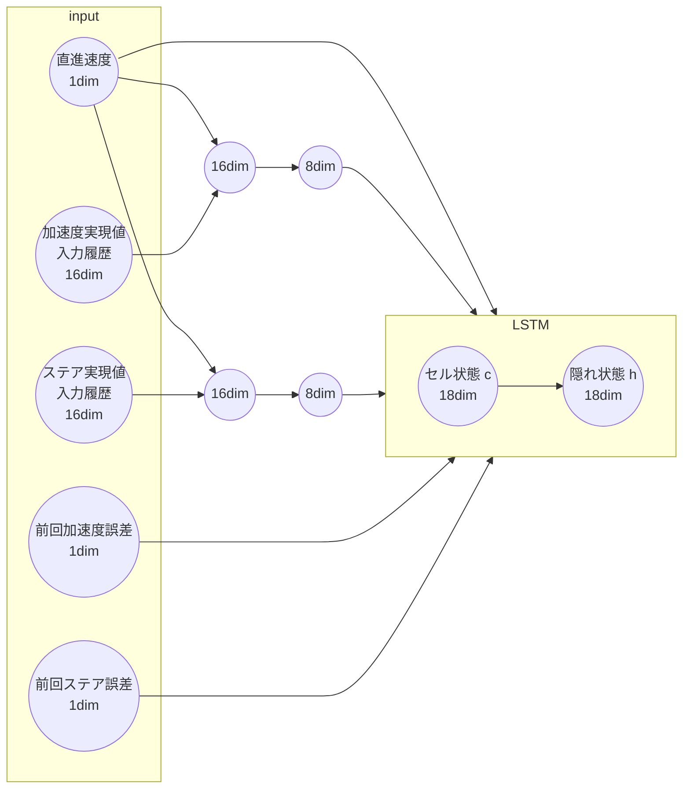

デコーダは次のような構造になっており、エンコーダで圧縮された情報は、デコーダLSTMの初期値および、加速度・ステア隠れ状態として用いられる。
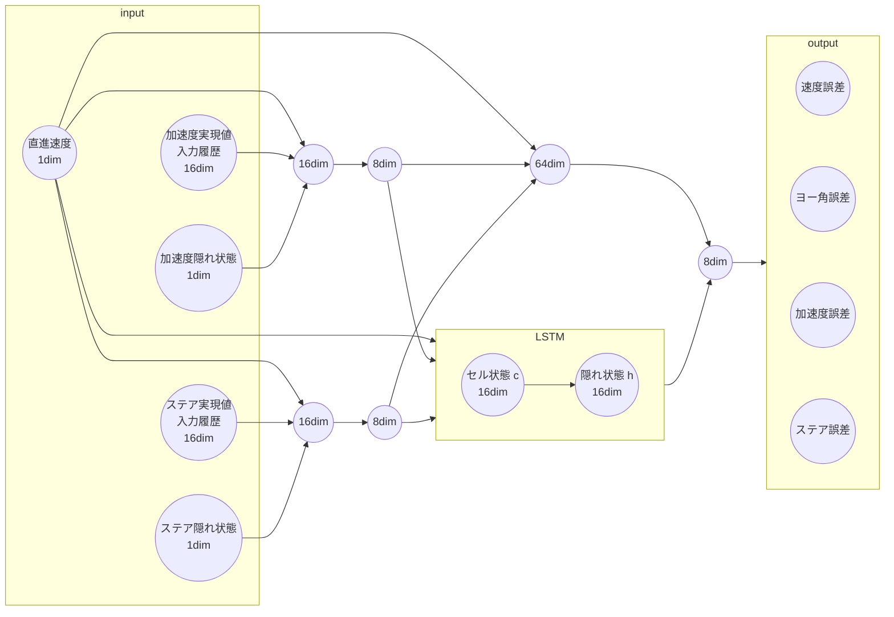

またエンコーダLSTMの初期値は次のようにオフラインで収集したデータからアテンション機構により抽出される。
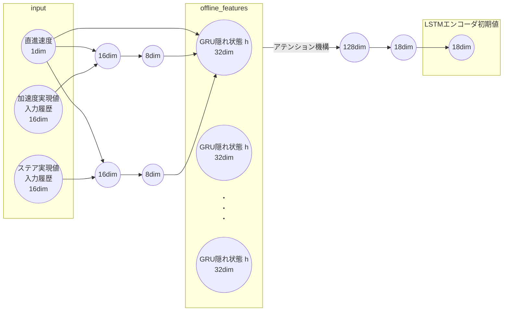

## コントローラ入力予定の取得

### 入力予定の予測

Vehicle Adaptorは $N$ ステップ先までのコントローラ側の加速度・ステア入力の予定 $(\alpha_0,\ldots,\alpha_N)$ および $(\delta_0,\ldots,\delta_N)$ （ただし $\alpha_0$ および $\delta_0$ はコントローラの現在の加速度・ステア入力）が与えられたとき、
ノミナルダイナミクスに従ってその入力を積分して得られる状態が（ノミナルダイナミクスと実際のダイナミクスのズレがあった場合でも）実現されるように入力を補正する。
コントローラがMPCで入力の予定がコントローラから与えられている場合は、その入力の予定をそのまま使うが、コントローラの入力の予定が得られない場合、コントローラの過去の入力 $(u_{-h},\ldots,u_0)$ （ここで $u$ は加速度・ステア入力のいずれか）から以下のいずれかの方法で、将来のある $N_0$ ステップ先 $(u_1,\ldots,u_{N_0})$ までコントローラの入力の予定の予測を行う。
その先においては一定値 $u_{N_0} = u_{N_0+1} = \cdots = u_N$ として定める。

- 過去の入力 $(u_{-h},\ldots,u_0)$ を用いて多項式回帰。
- $u_{-h}$ および $u_0$ から一次外挿。
- 事前にシミュレータなどで学習したNNモデルにより過去の入力 $(u_{-h},\ldots,u_0)$ および過去の速度履歴 $(v_{-h},\ldots,v_0)$ を用いた予測。

コントローラ入力の予定を予測するNNモデルは以下のようなLSTMエンコーダ・デコーダモデルを取る。

エンコーダの入力は速度およびコントローラの入力を用いる。
このエンコーダは直近の数ステップの履歴により更新される。

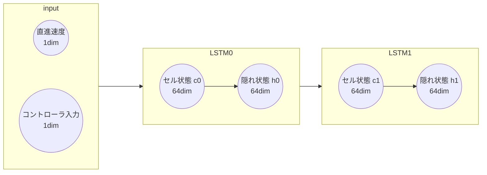

デコーダではコントローラ入力の変化率を予測する。
デコーダ入力は前回のコントローラ入力の変化率とコントローラ入力の履歴を用いる。
エンコーダにより圧縮された情報はデコーダLSTMの初期値として用いられる。

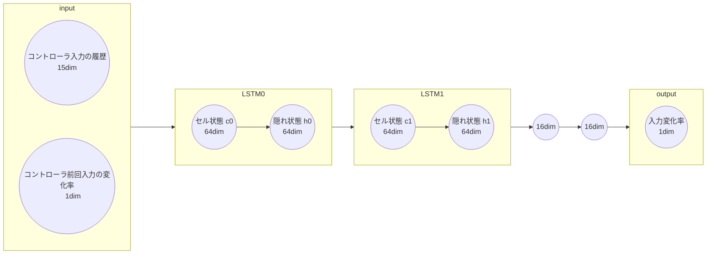
このデコーダを繰り返し用いることで、$N_0$ ステップ先までの入力の予測を得る。

### 後処理

上記の方法で得られた入力の予定 $(u_1,\ldots,u_N)$ をそのまま用いずに、平滑化して用いることもできる。
平滑化は最適化問題として表現され、決定変数は入力の変化率 $(d u_0,\ldots,d u_{N-1})$である。
$\bar u_{i + 1} = \bar u_i + du_i * dt_{\mathrm{ctrl}}$ （ $\bar u_{0} = u_0$ ）
と表したとき、次のようなコスト関数を最小化する。

$$
\sum_{i=0}^{N-1} \lambda_i ||\bar u_i - u_i||_2^2 + \alpha_i ||\bar u_i||_2^2 + \omega_i ||d u_i||_2^2  
$$

ここで1項目はもとの予測に近づけるようなコストである。
2項目は入力値を小さくするようなコストで基本的には終端コストのみ用いる。
3項目は入力の変化率を小さくするようなコストで、終端に近づくにつれてコストの重みは大きく設定する。

こうして得られた平滑化された入力の予測値 $(\bar u_1,\ldots,\bar u_N)$ をVehicle Adaptorに渡す。

## 最適化設計

MPCでは1ステップ $0.1 s$で $N=12$ステップ先まで予測している。
MPCにおける決定変数 $U\in \mathbb{R}^{N\times 2}$は各時刻における入力の変化率である。
ノミナルモデルあるいは学習モデルに基づき $U$を用いて現在の状態 $X[0]= x_0$から将来を予測したものを
$$X = (X[0],X[1],\ldots,X[N])\in \mathbb{R}^{(N+1)\times(6+M_{\mathrm{acc}} + M_{\mathrm{steer}})}$$
と表す。
ワールド座標 $xy$成分、直進速度、ワールド相対ヨー角、直進加速度実現値、ステア実現値、直進加速度入力値、ステア入力値の8成分に対する目標軌道 $X_{\mathrm{des}} \in \mathbb{R}^{(N+1)\times8}$ を用いてMPCコストは
$$J(X,U,X_{\mathrm{des}}) =\sum_{t=0}^{N-1} l_t(X[t],U[t],X_{\mathrm{des}}[t]) + l_N(X[N],X_{\mathrm{des}}[N])$$
のように設計される。ここで $l_t$はステージコスト、 $l_N$は終端コストを表し、 $l_t$および $l_N$には目標値との直進偏差、横偏差、速度偏差、ヨー角偏差、加速度偏差、ステア偏差、加速度入力値偏差、ステア各入力値偏差および、制約条件をコストとして扱ったものが入っている。
更にステージコスト $l_t$ には $U$ を小さくするコストが入っている。
入力の変化率 $U$ に対してコストを掛けることで入力の大きな変化を防いでいる。

MPCでは $J$ を最小化するような $U$ を求める。

## キャリブレーションNN

アクセル・ブレーキの踏み込み量に対する加速度実現値に対するキャリブレーションをNNベースで行うことができる。
加速度実現値自体を予測、あるいはベースとなる(精度は低いかもしれない)キャリブレーションマップの予測誤差を補正する形でNNを用いる。
NNは次のような単純な構造をしている。

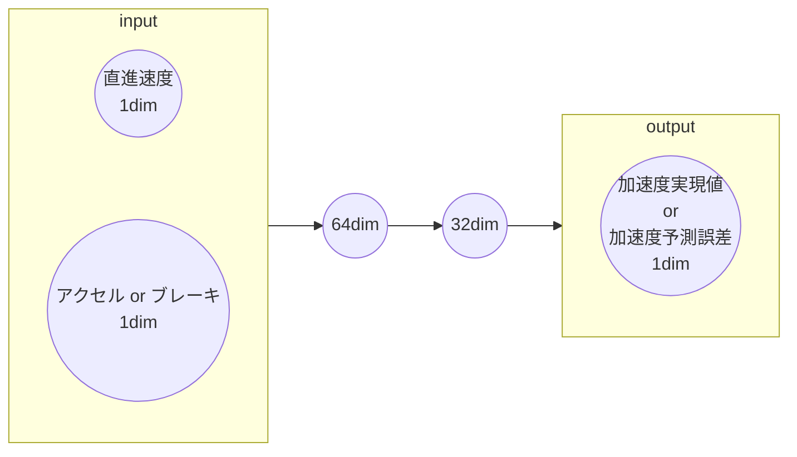

## 評価

### 実機実験

BSでの実験(40 km/h)での実験。
ノミナル走行では直線部分で20cmくらいの横偏差が出た。

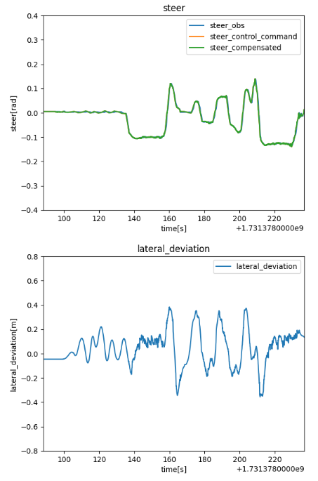

ノミナル走行における速度・加速度のグラフは次の通りで、一部加速度入力と実現値で乖離が見られた。

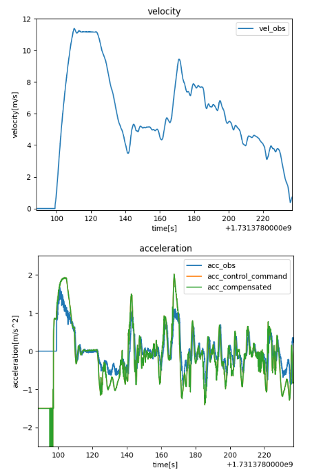

Vehicle adaptor導入ではじめの直線における横偏差が10cmくらいになった。

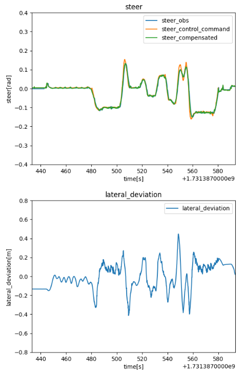

一方で速度・加速度に関しては、特に加速度入力と実現値が乖離していた部分において
Vehicle adaptor導入で振動が発生した。

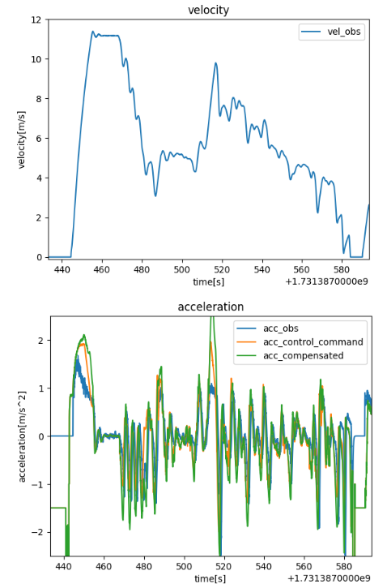

柏の葉での実験(15km/h)での実験。
ノミナルでカーブにおいて40cmくらいの横偏差が出た。

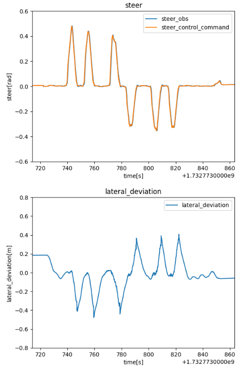

ノミナル走行における速度・加速度のグラフは次の通り。

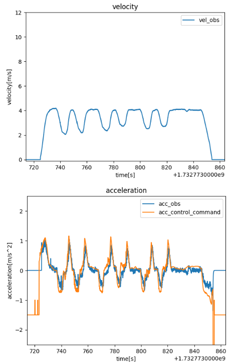

Vehicle adaptor導入で20cm以下の横偏差になったカーブもあるが、特に一番はじめのカーブなど良くも悪くもならなかったカーブもあった。
改善しなかった原因が学習側にあるのか、オンラインでの最適化側にあるのかなどを決定するための解析を今後行う予定である。

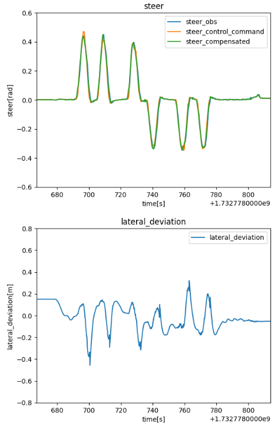

BS実験の後に加速度入力補正のアルゴリズムの修正を行ったが、速度・加速度は次の通り、Vehicle adaptor導入で特にノミナルに比べて振動が強くなるなどは見られなかった。
BSコースでも振動しなくなったかは今後の実験にて確認予定。

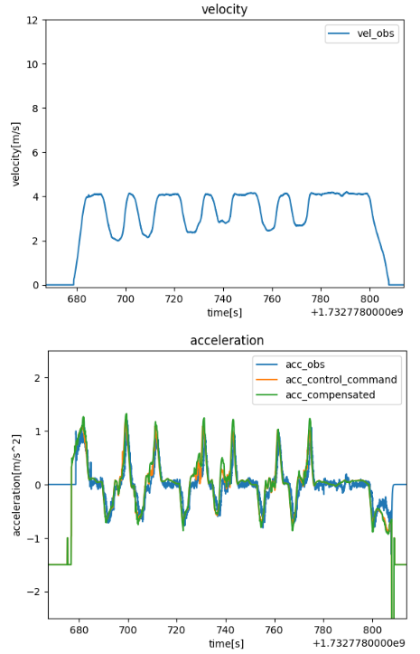

一方で最適化パラメータを変更すると、次のように直線（グラフでは9060 sの停止付近）にてステアの振動が見られた。
今後このような現象が起きにくくなるような修正を行いたい。

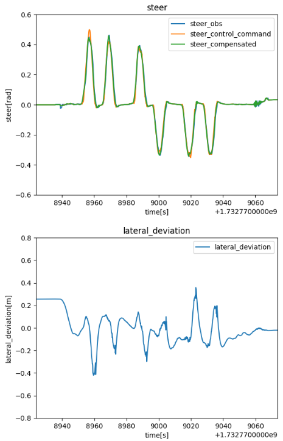

